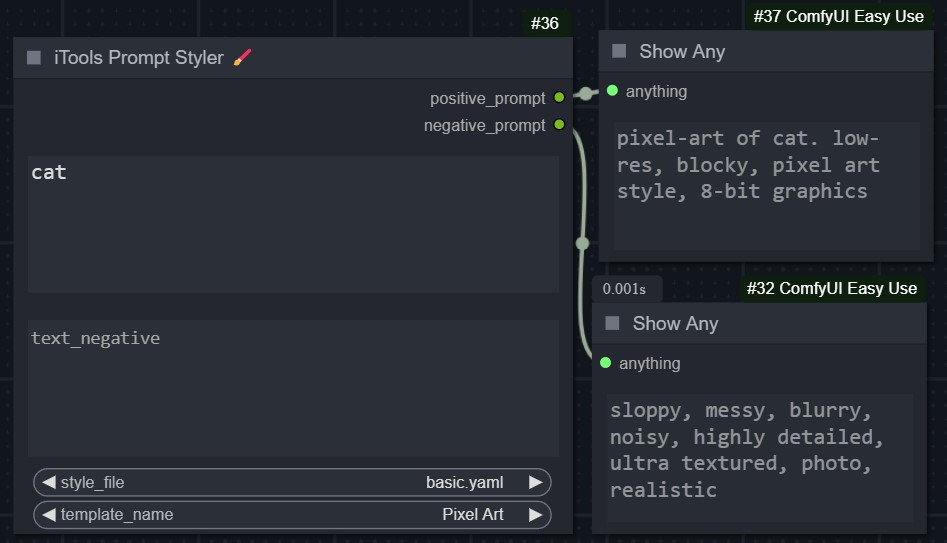
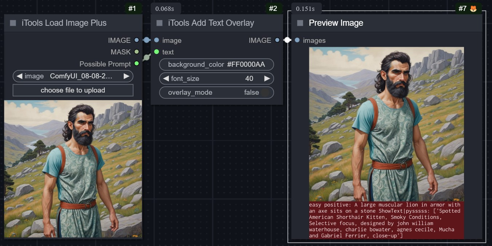

## iTools
The iTools are some quality of life nodes, like read a possible prompt used to create an image, save a prompt to file as a new line, read prompts from a multiline file. and the newly amazing prompt styler node that will help you quickly populate your {prompt} using a template name stored in an easily editable yaml file.

### Nodes:
### **iTools Paint Node**  

The iTools Paint node is currently in beta and functions as a standalone project. It may be the most complex node in ComfyUI, and future updates could break its functionality. However, I will strive to keep it working. All custom widget code was built from scratch specifically for ComfyUI and this node. It supports painting, compositing, remove background, text editing, and pasting images from the clipboard, making it the fastest mini Photoshop for ComfyUI.  

  

  

  

### **Features:**  
- **`Load image key`** – Will load an image from your desk to the canvas.
- **`Add text key`** - Will add custom text to the canvas.
- **`Paste image key`** - Will paste last copied image from the clipboard.
### **UI buttons:**  
- **`canvas key`** – Sets the canvas size.  
- **`fill key`** – Fills the canvas with the selected color.  
- **`clear key`** – Clears the currently selected layer.  
- **`hold key`** – Saves the current state of the node (quick save).  
- **`fetch key`** – Restores the saved state of the node (quick load).  

### **Shortcuts:**  
- **`Shift`** – Eyedropper tool for picking colors under the cursor while painting.  
- **`Alt`** – Stamps an image onto the background or foreground layer.  
- **`Alt`** (while the color picker is visible) – Swaps the position of the color palette.  

**# iTools Image Loader Plus:** is an enhancement of the original ComfyUI ImageLoader node. It attempts to return the possible prompt used to create an image. If the prompt isn't found directly, this node will search for the prompt within the following supported nodes in the workflow:

  - `CLIPTextEncodeSDXL`
  - `CLIPTextEncode`
  - `easy positive`
  - `easy showAnything`
  - `ShowText|pysssss`
  - `Eff. Loader SDXL`
  - `SDXLPromptStyler`
  - `iToolsPromptStyler`
  - `iToolsPromptStylerExtra`

If your prompt is within any of these nodes, you will be able to retrieve it. The `ShowText|pysssss` node is a convenient addition that you can integrate it into any workflow to make sure it will be retrieved by `iTools ImageLoaderPlus`.

**# iTools Prompt Styler 🖌️:** Helps you quickly populate your {prompt} using a template name stored in a yaml file. I chose yaml over json because it will be easier for the user to read, edit it or to add his own templates, it will load all yaml files in the styles folder, so you may add your unlimited files there and easily add your own templates.

**# iTools Prompt Styler Extra 🖌️🖌️:** Like iTools Prompt Styler, but you can mix up to 4 styles from up to 4 yaml files. check examples folder for basic workflow for this node.

`Example:` here are some examples you just use "cute cat" as a prompt and let `iTools Prompt Styler Extra` do the magic of mixing 4 different styles togather.

**# iTools Prompt Loader:** will try to load a prompt from a txt file, you need to provide a full path to a .txt file or try to use the default prompt.txt one is the examples folder, the node will return the prompt at given index (line number) note that count start from zero.

**# iTools Prompt Saver:** will append the given prompt as a new line to the given file, provide a full path to a .txt file or try to use the default prompt.txt one.

**# iTools Add Text Overlay:** will add an overlay bottom bar to show a given text, you may change the background color of the overlay bar and the font size.

`Example 1:` add text overlay

`Example 2:` add full prompt

`Example 3:` change background color and font size

**Edit:** iTools Add Text Overlay has been updated, and now you can add the text over or under the image

`Example:` Add text if overlay off: 

**# iTools Load Images:** will return list of images from a given directory with a given limit, for example if the limit is 4 it will return first 4 images in that directory.it will also return the list of these images names.

**# iTools Grid Filler:** Arranging a set of images into specified rows and columns, applying optional spacing and background color
`Example1:` when one image provided

`Example2:` when multi-images provided

**# iTools KSampler:** Identical to the original KSampler, but additionally provides the settings used to generate the image and the execution time.

**# iTools Line Loader:**
Will return a line from a multi line text at given index, help you make your own list of words or prompts and load them one by one or randomized.

**# iTools Text Replacer:** A text replacer tool that might also be useful
`Example1:` with line loader tool you may quickly paste your prompts in lines and load them one by one or randomized, then you combine it with text replacer to get prompt variations. The total count of lines will be returned, allowing it to be used as a batch counter.

`Example2:` Another example useful for randomization: with two lists of just 5 elements each, you can get up to 25 possible outputs

`Example3:` With three lists you get up to 125 possible outputs

**# iTools Vae Preview:**
Merges VAE decoding and image preview into one node, The goal of `iTools Vae Preview`  is to Decode & Preview the image at same node, so you do not have to use the `VAEDecod` node every time before preview an image.

**# iTools Checkerboard:**
Generates chessboard-like patterns, either in black and white or with random colors.

`Example1:`

`Example2:`

_Wait for more..._

Support me on PayPal

